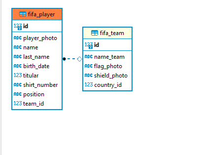
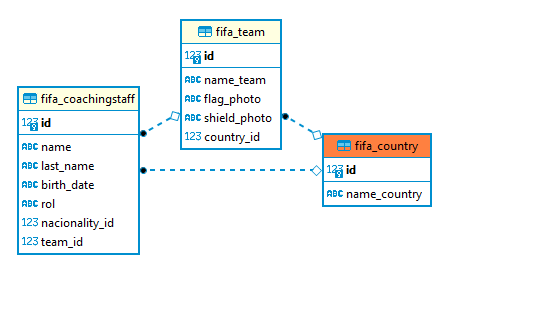

# Michael Page - Prueba Backend

Versión Python: `^3.5`

Versión django: `3.1.7`

#### Configuración del proyecto (Linux/Windows)

git clone https://github.com/Rojas-Andres/challenge_michael_page
cd rebus

### Cree virtulenv
    primero instale virtualenv
        pip install virtualenv
    
    crear virtualenv
        virtualenv entorno
    Activar entorno virtual en powershell
        .\entorno\Scripts\activate.ps1 
    Activar entorno virtual en terminal de windows
        .\entorno\Scripts\activate.bat 

### Instale requerimientos

pip3 install -r requeriments.txt

pip install -r requeriments.txt

### Ejecute migraciones:

python manage.py makemigrations

python manage.py migrate

## Correr proyecto sin docker
## Correr server

python3 manage.py runserver

python manage.py runserver

### Test

python3 manage.py test

python manage.py test

## Correr proyecto con docker
docker build -t michael_page .

docker run --name michael_page_app -p 8000:8000 -d michael_page

Tener en cuenta que se ignora la base de datos local en el caso que corramos el server sin docker, ya que eso se definio en el .dockerignore

## Diagramas

# Validaciones 

## Team

	Creacion del equipo(Metodo POST):
		Se valida que solo exista un equipo por pais.

		Se valida que el nombre del equipo no se repita.

		Se valida que el pais exista en la base de datos.

        Se valida que no se puedan crear mas de 32 equipos ya que solo son 32 equipos que van al mundial.

        Se valida el archivo que se sube extensiones permitidas ["PNG", "png", "jpg", "JPG"]
    
	Actualizacion equipo(Metodo PATCH):

		Se valida que el pais exista para la actualizacion del equipo

		Se valida que al actualizar el equipo solo exista un pais por equipo.

		Se valida que solo exista un nombre por equipo.

        Se valida que un equipo no pueda registrar mas de 23 jugadores.

## Player
	
	Creacion del jugador(Metodo POST):
    	
        Se valida el formato de fecha (YYYY-MM-DD).
        
		Se valida que el equipo con el que se registra el jugador ya este creado en la base de datos.
        
		Se valida que no hayan 11 jugadores titulares por equipo.

		Se valida que no se repita una mismo numero de camiseta por equipo.

        Se valida que la posicion exista (posiciones [Arquero,Defensa,Centrocampista,Delantero])

        Se valida que el jugador no pueda tener menos de 15 años.

	Actualizacion del jugador metodo (PATCH permite actualizar solo los campos que se le envian):

		Se valida el formato de fecha (YYYY-MM-DD).

		Se valida que al actualizar el equipo del jugador ya se encuentre en la base de datos.

		Se valida que al actualizar el jugador (titular)este no vaya a superar los 11 titulares por reglamento .

		Se valida que al actualizar no se repita una mismo numero de camiseta por equipo.

        Se valida que la posicion exista (posiciones [Arquero,Defensa,Centrocampista,Delantero])

        Se valida que al actualizar el jugador no pueda tener menos de 15 años.
        
# Coaching

    Creacion del cuerpo tecnico(METODO POST):

        Se valida el formato de fecha (YYYY-MM-DD).

		Se valida que el equipo con el que se registra el cuerpo tecnico ya este creado en la base de datos.

		Se valida que la nacionalidad con la que se crea el cuerpo tecnico exista en la base de datos.

		Se valida que la rol exista (roles [Tecnico,Asistente,Medico,Preparador])

    Actualizacion del cuerpo tecnico:
        Se valida el formato de fecha (YYYY-MM-DD).

        Se valida que el equipo con el que se registra el cuerpo tecnico ya este creado en la base de datos.

        Se valida que la nacionalidad con la que se va actualizar exista en la base de datos.

        Se valida que la rol exista (roles [Tecnico,Asistente,Medico,Preparador]).

## Recomendaciones

    Cuando se esta guardando la imagen del escudo del equipo y la bandera del equipo , ese proceso deberia de guardar la imagen en un storage en la nube por ejemplo S3 y que cuando se le haga la peticion a la api de obtener equipo esta devuelva la url de donde se encuentra almacenada para que con solo ir a la url se realice la descarga automatica , el proceso actualmente esta guardando las imagenes en una carpeta llamada media , dentro de ella hay dos subcarpetas una es flag (para las banderas ) y otra es shield (para el escudo)

## Dudas

    ¿Promedio de número jugadores suplentes en cada equipo?
        
        - Para la solucion de esta pregunta lo que hice fue agrupar por equipo y luego sacar los suplentes de cada equipo y dividirlos entre el total de jugadores de cada equipo. Tengo mis dudas referente a esa solucion.

    ¿Cuál es el promedio de número de jugadores en cada equipo?

    Para sacar el porcentaje de jugadores por equipo respecto a mis jugadores totales se hizo lo siguiente
        1- contar y agrupar los jugadores de cada equipo 
        2- contar todos los jugadores de todos los equipos en un subquery
        3 - dividir los jugadores de cada equipo sobre los jugadores totales, esto me arroja el valor porcentual en jugadores que tiene cada equipo